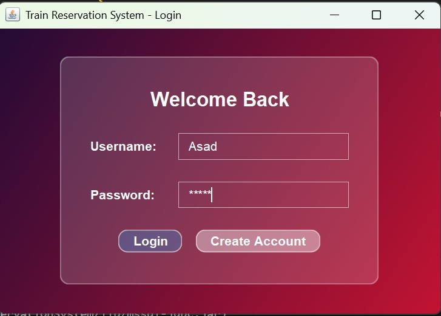
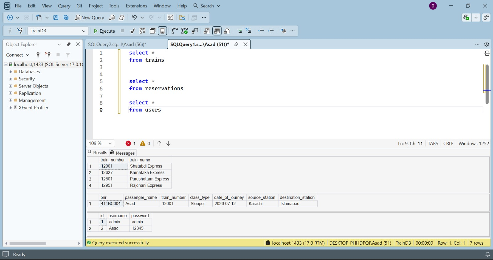

# 🚂 Online Train Reservation System 

A modern, robust, and visually stunning Online Train Reservation System built entirely in **Java Swing**. This application features a custom-built rendering engine that delivers a state-of-the-art **Glassmorphism** UI aesthetic, complete with translucent inputs, frosted glass panels, and vibrant gradients.

---

## ✨ Key Features

*   **🔒 Secure Authentication**: Robust Login and Registration flow to ensure secure access.
*   **🎫 Ticket Booking System**: Streamlined reservation process with auto-fetching train details.
*   **❌ Cancellation System**: Fetch existing tickets using a PNR number and securely cancel them.
*   **💎 Glassmorphism UI**: Custom Java2D UI components that simulate frosted glass over vibrant background gradients.
*   **🗄️ Automated Database**: Built-in initialization that automatically creates schemas and populates dummy data on startup.

---

## 📸 Screenshots

| Screen | Screen |
|---|---|
|  <br> **User Login Form** |  <br> **User Registration** |
|  <br> **Authentication Success** |  <br> **System Dashboard** |
|  <br> **Ticket Reservation** |  <br> **Booking Confirmation** |
|  <br> **Ticket Cancellation** |  <br> **Cancellation Confirmation** |
|  <br> **Ticket Successfully Cancelled** |  <br> **Database Schema & Connections** |

---

## 🛠️ Technology Stack

*   **Language**: Java
*   **GUI Framework**: Java Swing & AWT (Custom rendering)
*   **Database**: Microsoft SQL Server / SQLite (via JDBC)

---

## 🚀 How to Run

1.  **Clone the repository**:
    ```bash
    git clone https://github.com/asad594/OIBSIP.git
    cd OIBSIP/Java-Task1-OnlineReservationSystem
    ```
2.  **Compile the source code**:
    ```bash
    javac -sourcepath src src/Main.java
    ```
3.  **Run the application**:
    ```bash
    java "-Djava.library.path=lib" -cp "src;lib/*" Main
    ```
*(Note: The application will automatically initialize the database and tables upon first launch!)*
