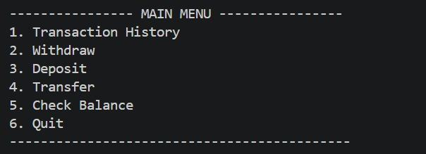
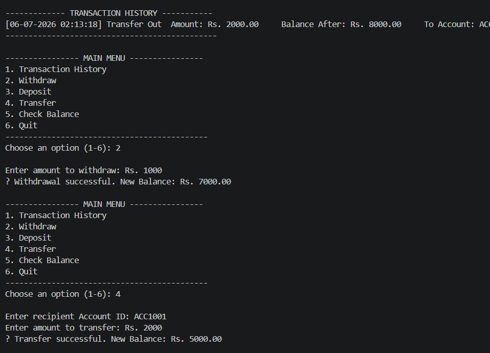
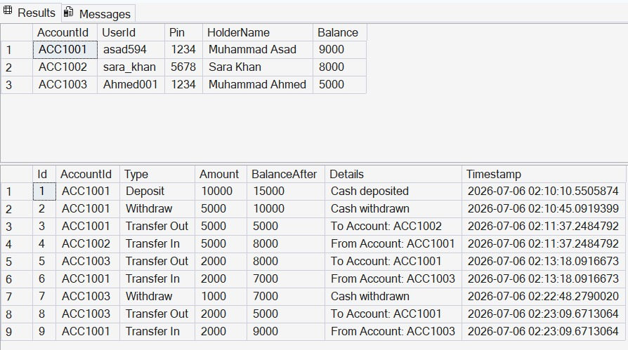

<div align="center">

# 🏧 Java ATM Interface Simulator

### OIBSIP — Java Development Track | Task 3

[](https://www.java.com/)
[](https://www.microsoft.com/sql-server)
[]()
[]()

</div>

---

## 📖 Overview

A console-based **ATM Machine Simulation** built in Java, featuring secure PIN authentication, real-time transaction processing, and persistent data storage using **SQL Server** via JDBC. Built following Object-Oriented Programming principles with a clean, multi-class architecture.

---

## 🖼️ Screenshots

<div align="center">

#### Main Menu



<br/>
<br/>

#### Transaction Flow (Withdraw & Transfer)



<br/>
<br/>

#### Database Persistence — Accounts & Transactions Tables (SQL Server)



</div>

---

## ✨ Features

- 🔐 **Secure Login** — User ID + 4-digit PIN authentication with a 3-attempt lockout
- 🆕 **Account Creation** — New users can create an account with an auto-generated Account ID
- 💰 **Check Balance** — View current balance instantly
- 💵 **Deposit & Withdraw** — Real-time balance updates with insufficient-funds protection
- 🔄 **Fund Transfer** — Transfer money between accounts with recipient validation
- 📜 **Transaction History** — View a full log of session transactions
- 🗄️ **Persistent Storage** — All accounts and transactions saved to **SQL Server**, so data survives program restarts

---

## 🛠️ Tech Stack

| Component | Technology |
|---|---|
| Language | Java (Core, OOP) |
| Database | Microsoft SQL Server |
| Connectivity | JDBC (Microsoft SQL Server JDBC Driver) |
| Interface | Console-based (CLI) |

---

## 🏗️ Project Structure

```
Java-Task3-ATMInterface/
├── src/
│   ├── Main.java              # Entry point
│   ├── ATM.java                # User-facing flow (menus, login, transactions)
│   ├── Bank.java                # Manages all accounts, transfers, persistence
│   ├── Account.java             # Account model + business logic
│   ├── Transaction.java         # Transaction record model
│   └── DatabaseManager.java     # SQL Server connectivity (JDBC)
├── screenshots/
└── README.md
```

---

## 🗄️ Database Schema

| Table | Columns |
|---|---|
| **Accounts** | AccountId (PK), UserId, Pin, HolderName, Balance |
| **Transactions** | Id (PK), AccountId (FK), Type, Amount, BalanceAfter, Details, Timestamp |

---

## ▶️ How to Run

**Prerequisites:** JDK installed, SQL Server running locally, `mssql-jdbc` driver `.jar` in a `lib/` folder.

```bash
# Compile
javac -cp ".;lib\mssql-jdbc-13.4.0.jre11.jar" src\*.java -d src

# Run
cd src
java -cp ".;..\lib\mssql-jdbc-13.4.0.jre11.jar" Main
```

### Demo Login Credentials
| User ID | PIN | Account ID |
|---|---|---|
| asad594 | 1234 | ACC1001 |
| sara_khan | 5678 | ACC1002 |

---

## 🎯 Learning Outcomes

- Applied **Object-Oriented Programming** (encapsulation, class design) to model real-world banking operations
- Implemented **JDBC connectivity** with SQL Server for persistent data storage
- Handled authentication, input validation, and error handling in a CLI environment
- Practiced structured **switch-case menu navigation** and session state management

---

<div align="center">

**Part of the [OIBSIP](../) repository** — Oasis Infobyte Internship, Java Development Track

</div>
