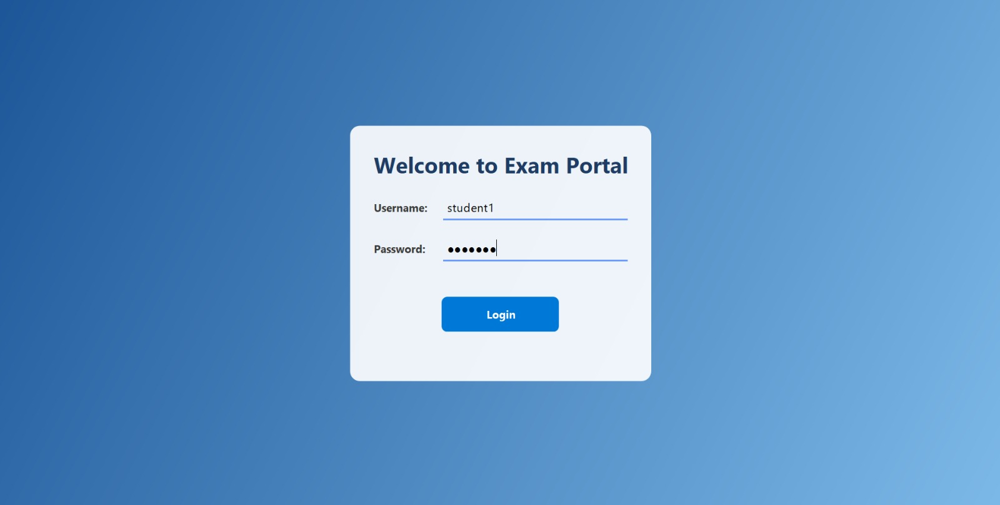
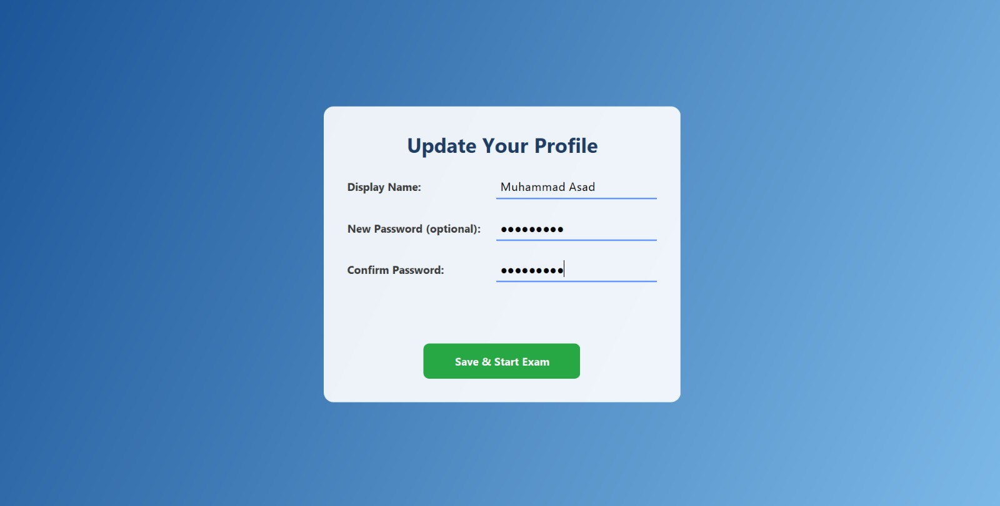
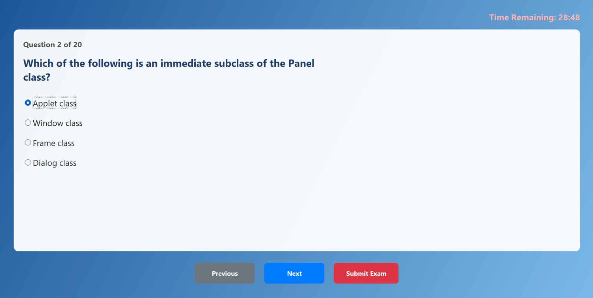
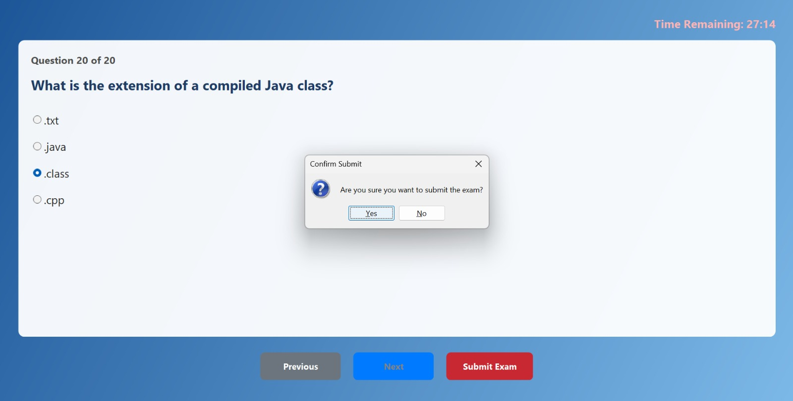
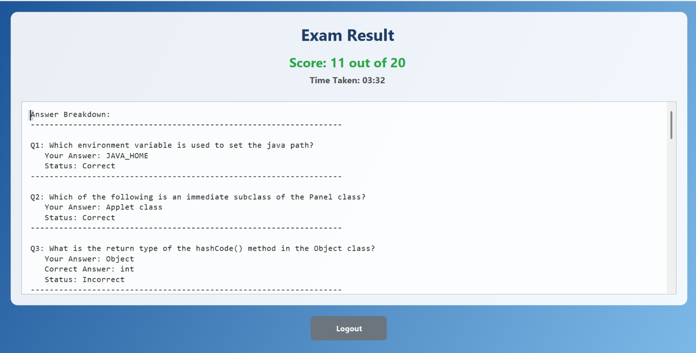

<div align="center">

# 🎓 Online Examination System
### Task 4 — OIBSIP Java Development Track

[](https://www.java.com/)
[](https://docs.oracle.com/javase/tutorial/uiswing/)
[](#)
[](https://github.com/asad594/OIBSIP)

*A desktop exam-taking experience — login, update your profile, sit a timed test, and see your results instantly.*

</div>

---

## 📖 About

A desktop-based **Online Examination System** built with **Java Swing**, simulating a real exam-taking experience end-to-end: secure login, profile/info management, a timed multiple-choice test, and an instant, visual result summary — all with a custom-painted, non-default Swing look.

---

## ✨ Features

- 🔐 **Login screen** — clean card-based UI with a security note
- 📝 **Profile / info update screen** — user can view and update their details before starting the exam
- ⏱️ **Live countdown timer** — turns to a warning color when time is running low
- 📊 **Question progress dots** — shows which question you're on at a glance
- 🖱️ **Interactive option cards** — selected answer highlighted with border + filled radio
- 📤 **Submit confirmation dialog** — asks the user to confirm before final submission
- 🎯 **Result screen** — donut-chart style score indicator
- 📈 **Stats breakdown** — Correct / Incorrect / Time taken, plus a full answer review with check/cross icons
- 🎨 **Custom-painted UI** — rounded cards, color-coded badges, no default Swing look

---

## 🛠️ Tech Stack

| Component        | Technology                          |
|-------------------|--------------------------------------|
| Language          | Java                                 |
| UI Framework      | Java Swing (custom `Graphics2D` painting) |
| Timer             | `javax.swing.Timer`                  |
| Design            | Custom rounded panels, `Colors.java` constants class |

---

## 📂 Folder Structure

```
Java-Task4-OnlineExaminationSystem/
├── src/
│   ├── LoginPanel.java
│   ├── ProfilePanel.java
│   ├── ExamPanel.java
│   ├── ResultPanel.java
│   ├── Colors.java
│   └── ...
├── screenshots/
│   ├── login.jpeg
│   ├── profile.jpeg
│   ├── exam.jpeg
│   ├── submittingExam.jpeg
│   └── result.jpeg
└── README.md
```

---

## 🖼️ Screenshots

<div align="center">

| 🔐 Login Screen | 📝 Update Info Screen |
|:---:|:---:|
|  |  |

| 📝 Exam Screen | 📤 Submitting Exam |
|:---:|:---:|
|  |  |

| 🎯 Result Screen |
|:---:|
|  |

</div>

---

## ▶️ How to Run

1. Clone the repository:
   ```bash
   git clone https://github.com/asad594/OIBSIP.git
   ```
2. Navigate to this task's folder:
   ```bash
   cd OIBSIP/Java-Task4-OnlineExaminationSystem/src
   ```
3. Compile and run:
   ```bash
   javac *.java
   java Main
   ```

---

## 👤 Author

**Muhammad Asad** — Software Engineering Student, Bahria University Karachi
[GitHub](https://github.com/asad594) · [LinkedIn](https://www.linkedin.com/in/muhammadasad-arshad/)

---

### 🌟 Part of my OIBSIP Java Development Track journey
