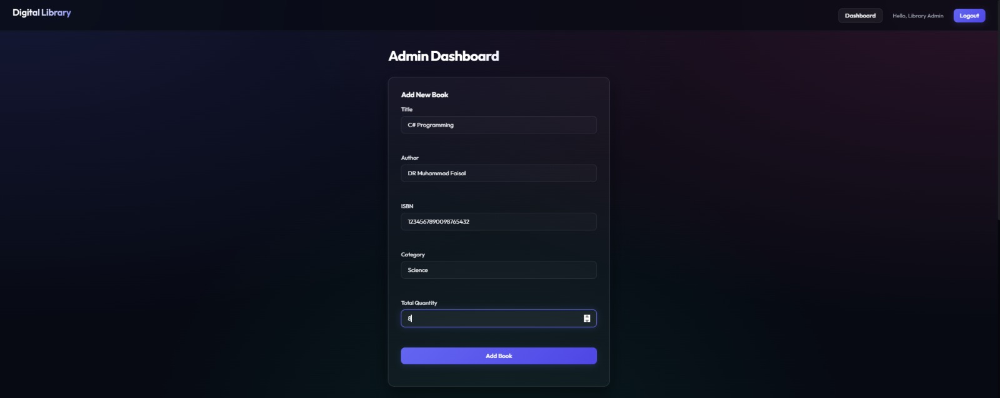
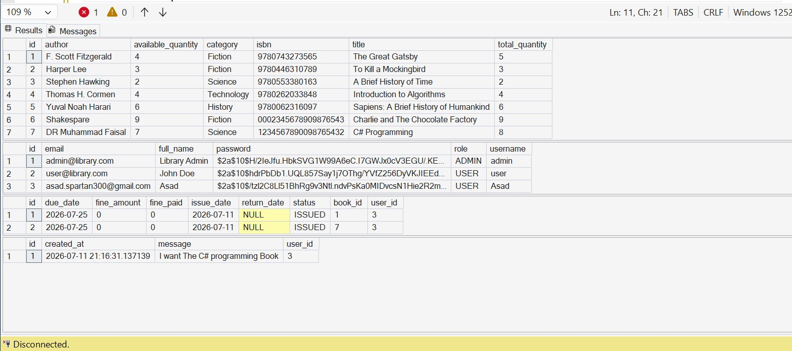
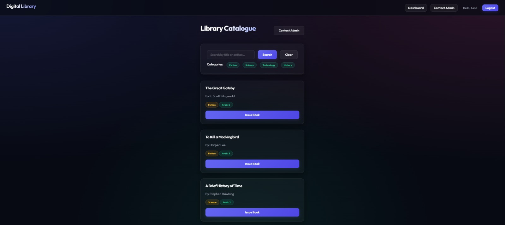
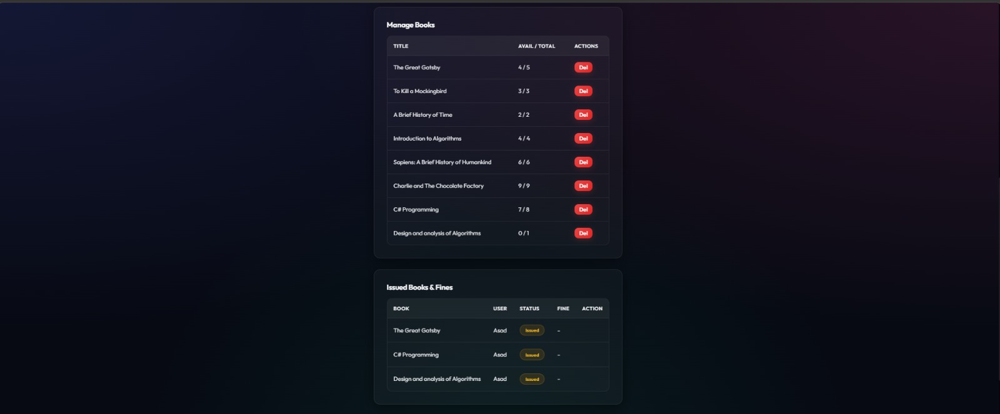
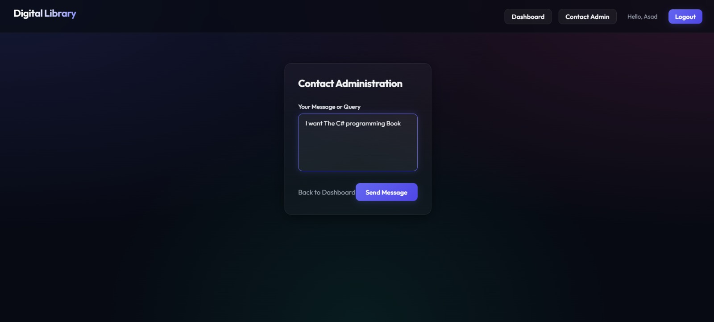

# 📚 Task 5: Digital Library Management System

A modern, secure, and fully-featured **Digital Library Management System** built with **Spring Boot**, **Spring Security**, **Thymeleaf**, and **Microsoft SQL Server**. This application supports user registration, catalog search, book issuing/returning, fine calculation, support messaging, and an advanced book booking reservation system for out-of-stock titles.

---

## ✨ Features

### 👤 User Features
*   **Secure Authentication & Session Management:** User registration and custom security-backed login page.
*   **Interactive Book Catalog:** Browse all books, search by title/author, and filter books by categories (Fiction, Science, Technology, History).
*   **Book Issuing & Returning:** Instantly issue available books with a standard 14-day return period. Return books from the dashboard.
*   **Fines Tracking:** Automatic calculation of overdue fines (₹10/day) displayed directly in the user profile dashboard.
*   **Advance Booking:** Reserve out-of-stock books (copies = 0) in advance. The booking is automatically fulfilled (and the book issued) when another member returns the book.
*   **Contact Admin:** Send message queries/feedback directly to library administrators.

### 👑 Admin Features
*   **Dynamic Inventory Dashboard:** Add new books (with details like ISBN, quantity, author, category) and delete existing titles from the catalog.
*   **Transaction Logging:** View all ongoing issues, due dates, calculated fines, and borrower names.
*   **User Management:** View list of registered members.
*   **Support Helpdesk:** View and respond to contact/feedback messages submitted by users.

---

## 🛠️ Tech Stack

*   **Backend:** Java 17+, Spring Boot (3.2.5), Spring Data JPA, Spring Security
*   **Frontend:** HTML5, Thymeleaf, Vanilla CSS (Glassmorphism design)
*   **Database:** Microsoft SQL Server (integrated security/Windows authentication)
*   **Connection Pool:** HikariCP
*   **Build Tool:** Maven

---

## 💻 Screenshots

| Screen | Screen |
|---|---|
|  <br> **User Dashboard** |  <br> **Database Relationships & Connection** |
|  <br> **Book Catalog (Available Books)** |  <br> **Book Catalog (Advance Booking Option)** |
|  <br> **Admin Panel (Inventory List)** |  <br> **Admin Panel (Add New Book Form)** |
|  <br> **Admin Panel (Active Issues & Fines)** |  <br> **Admin Panel (Registered Members)** |
|  <br> **User Contact Form** |  <br> **Admin Panel (Helpdesk Queries)** |

---

## 🚀 Setup & Installation

### 1. Database Configuration
Make sure SQL Server is running locally on port `1433`. The application uses a database named `librarydb` with integrated Windows Authentication.

Update the connection string in `src/main/resources/application.properties` if necessary:
```properties
spring.datasource.url=jdbc:sqlserver://localhost:1433;databaseName=librarydb;integratedSecurity=true;encrypt=true;trustServerCertificate=true;
```

*Note: Since integrated security is enabled, the Windows DLL library `mssql-jdbc_auth-12.4.2.x64.dll` (included in `/lib`) is required in the native path.*

### 2. Build the Project
Compile the Java sources using the provided Apache Maven wrapper:
```powershell
$env:JAVA_HOME="C:\Program Files\Java\jdk-24" # Set Java JDK home path
.\apache-maven-3.9.6\bin\mvn.cmd clean compile
```

### 3. Run the Application
Run the project with the native DLL directory passed in the JVM arguments:
```powershell
$env:JAVA_HOME="C:\Program Files\Java\jdk-24"
.\apache-maven-3.9.6\bin\mvn.cmd spring-boot:run "-Dspring-boot.run.jvmArguments=-Djava.library.path=lib"
```

Once started, the application will be hosted on: **[http://localhost:8081](http://localhost:8081)**

---

## 🔑 Default Accounts

Default accounts are automatically seeded into the database on startup:

*   **Administrator:**
    *   **Username:** `admin`
    *   **Password:** `admin123`
*   **Standard User:**
    *   **Username:** `user`
    *   **Password:** `user123`
